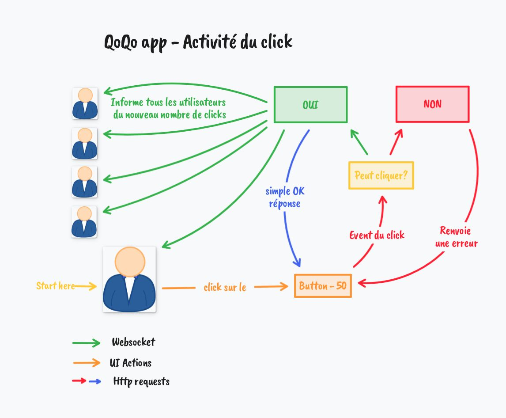

# QoQo app

## Setup and run 🔨

### Setup

#### Database 💾
Go on `qoqo/appsettings.json` and change the db file path if needed.

Currently is `Data Source='/Users/Shared/db/qoqo.db'` and it's work only on MacOS and Linux.

#### Admin password 🔑
Go on `qoqo/Model/QoqoContext.cs` at line `44`.

Update the "PasswordHash" to your password hash, here is some pre-made hash:
- `1234`: `$2a$11$j2q4.IDiiv1c0IIjzi3ZcO2rx1IMrqBZnJ1f84Gy2tfaG31D4cM9q`
- `admin`: `$2a$11$5RFyo7oV.O7CMHbOK/8UyuSZiLHPSOOXz4wF3o5FyztAJ1zTYyJpK`

### Run 🚀

Then run the app:
```bash
cd qoqo
dotnet run
```

#### URL 🌐
- Swagger URL: [https://localhost:7257/swagger/index.html](https://localhost:7257/swagger/index.html)
- App URL: [https://localhost:44460/](https://localhost:44460/)

## Test 🚧

Please run the test in coverage mode because parallel test is not supported.

## Diagrams

I create an **activity** and **use case** diagrams for the projects.

| Activity                                             | UseCase                                              |
|------------------------------------------------------|------------------------------------------------------|
|  |  |

## Dev tools 🔧

### Setup db bash instructions

```bash
dotnet tool install --global dotnet-ef
dotnet add package Microsoft.EntityFrameworkCore.Design
dotnet ef database update
```

To create a migration for the database:
```bash
dotnet ef migrations add SomeTableChange
```

### Usage of websocket

#### Backend

To call websocket, inject `IHubContext<OfferHub> hubContext` dependency in the controller.

Then you can call all listener with:

```c#
await _hubContext.Clients.All.SendAsync("ReceiveMessage", "Hello from the server");
```

#### Fronted

To get the websocket connection, you need to add this in TypeScript:

```ts
const hubConnection = new HubConnectionBuilder()
  .withUrl(`${baseUrl}offerHub`)
  .build();

hubConnection.start();

// The `ReceiveMessage` correspond to the name of the method in SendAsync
hubConnection.on('ReceiveMessage', (message) => {
    // Whatever you want to do with the message
});
```